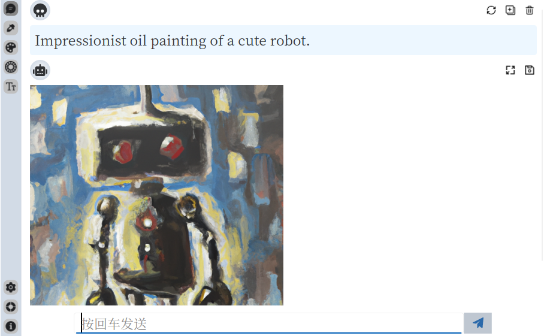

[English Document](./README.md)

#### 介绍
不断添加常用UI工具。

#### 功能
- [x] 支持`OpenAI`生成图片
- [x] 支持获取图片像素颜色
- [x] 支持调色板
- [x] [显示Atlassian颜色板](https://atlassian.design/resources/color-palette-resources)
- [x] 支持查看系统字体

#### 如何构建？
- 安装`Rust`和`Cargo`
- 执行`make build`
- [Makefile](./Makefile)了解更多

#### 参考
- [Slint Language Documentation](https://slint-ui.com/releases/1.0.0/docs/slint/)
- [github/slint-ui](https://github.com/slint-ui/slint)
- [Viewer for Slint](https://github.com/slint-ui/slint/tree/master/tools/viewer)
- [LSP (Language Server Protocol) Server for Slint](https://github.com/slint-ui/slint/tree/master/tools/lsp)
